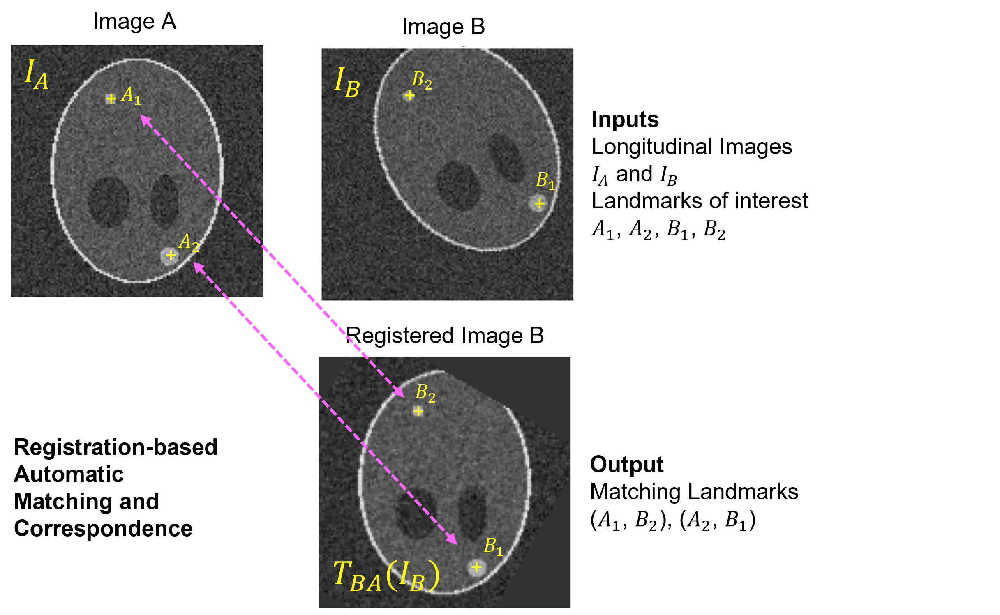

Registration-based Automated Matching and Correspondence (RAMAC) is a tool for identify corresponding annotated regions of interest in a sequence of images.

This repository contains code used in the paper:
**_Image registration based automated lesion correspondence and tracking pipeline for longitudinal CT data_**

It is originally developed as part of the FDA-Novartis collaboration to analyze correspondence of metastatic breast lesions in a longitudinal imaging study.

## Installation

You can install `RAMAC` from source available on GitHub. If you prefer, you can clone it and run the `setup.py` file. Use the following commands to get a copy from GitHub and install all dependencies:

```bash
git clone https://github.com/DIDSR/RAMAC.git
cd RAMAC
pip install .

Once installed, you can run the test script from the `test` folder.

