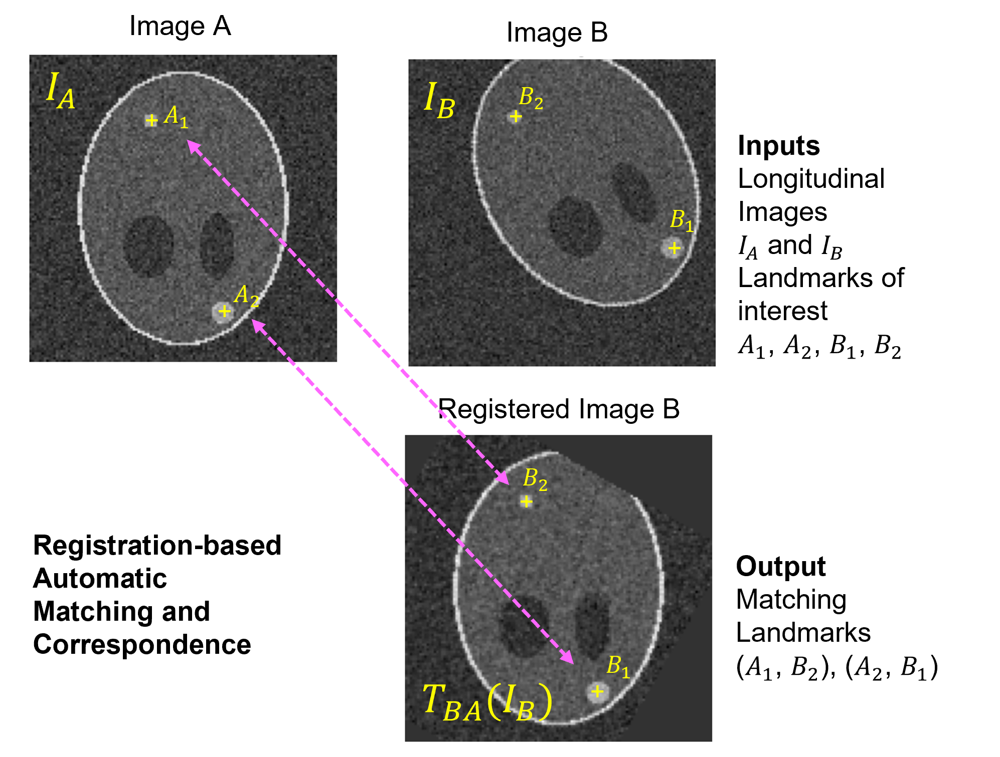

# **Registration-based Automated Matching and Correspondence (RAMAC)** 

RAMAC is a tool for identifying corresponding annotated regions of interest in a sequence of volumetric images. It is originally developed as part of the FDA-Novartis collaboration to analyze correspondence of metastatic breast lesions in a longitudinal imaging study.

In this guide, we present a comprehensive overview of the `Registration-based Automated Matching and Correspondence (RAMAC) package`.

## TL; DR

RAMAC is a software tool that streamlines the process of automating matching and establishing correspondence between longitudinal medical image datasets. It consists of a two-phase sequential pipeline, combining registration and correspondence algorithms to efficiently analyze and thereby establish correspondence. For example, in a longitudinal imaging study, multiple lesions may be annotated across many DICOM image series. This tool may be used to find corresponding annotations in all image series that correspond to same lesion.

## Algorithm Overview

The RAMAC algorithm comprises of a two-phase sequential pipeline:
- Firstly, the algorithm performs *three-dimensional rigid registration* to register longitudinal medical images.

- Correspondence of the regions or landmarks of interest is next established by an *adaptive Hungarian* algorithm.

The algorithm expects volumetric images and coordinates of landmarks as **inputs**. The landmark coordinates can be inputted using stored _comma-separated values (CSV)_ files. The tool converts the input images to SimpleITK format and the landmark cooridnates to physical coordinates. Image registration is performed next.
For example, in the `Overview` figure of RAMAC below, image registration is performed on the input images with one designated as fixed image (Image A) and other as moving (Image B). Currently RAMAC supports rigid registration using stochastic gradient descent as optimzer and linear interpolant. This workflow generates a transform $T_{BA}$ that is applied to the landmark coordinates in the moving image to produce transformed coordinates. The transformed coordinates are then matched with landmark coordinates in fixed image using the adaptive Hungarian algorithm. As **outputs** users can observe correspondences in stored _CSV_ files. The region-of-interest (ROIs) of the corresponding landmarks can also be plotted with RAMAC for visual inspection of the results. There may be cases where a corresponding landmark does not exist in one of the images. In such cases RAMAC assign the corresponding landmarks as 'Unmatched' to indicate unique landmarks. 



## Intended Purpose

RAMAC is intended to automate manual work needed to identify corresponding anatomical landmarks in a series of images. The package relies solely on image registration and does not require additional metadata.

## Installation

You can install `RAMAC` from source available on GitHub. If you prefer, you can clone it and run the `setup.py` file. Use the following commands to get a copy from GitHub and install all dependencies:

Once installed, you can run the `test_script` from the `test` folder.

```bash
git clone https://github.com/DIDSR/RAMAC.git
cd RAMAC
pip install .
```

## Getting Started

User manual and examples can be found in the [RAMAC Documentation](https://ramac.readthedocs.io/en/latest/) pages.

## Authors
- Subrata Mukherjee
- Qian Cao

## Disclaimer

About the Catalog of Regulatory Science Tools
The enclosed tool is part of the Catalog of Regulatory Science Tools, which provides a peer-reviewed resource for stakeholders to use where standards and qualified Medical Device Development Tools (MDDTs) do not yet exist. These tools do not replace FDA-recognized standards or MDDTs. This catalog collates a variety of regulatory science tools that the FDA's Center for Devices and Radiological Health's (CDRH) Office of Science and Engineering Labs (OSEL) developed. These tools use the most innovative science to support medical device development and patient access to safe and effective medical devices. If you are considering using a tool from this catalog in your marketing submissions, note that these tools have not been qualified as Medical Device Development Tools and the FDA has not evaluated the suitability of these tools within any specific context of use. You may request feedback or meetings for medical device submissions as part of the Q-Submission Program.
For more information about the Catalog of Regulatory Science Tools, email RST_CDRH@fda.hhs.gov.

Tool Reference 
* RST Reference Number: RST24AI19.01
* Date of Publication: 10/23/2025
* Recommended Citation: U.S. Food and Drug Administration. (2025). RAMAC: Registration based Automated Matching and Correspondence (RST24AI19.01). https://cdrh-rst.fda.gov/ramac-registration-based-automated-matching-and-correspondence

## Cite

If you use this project in academic work or publications, we appreciate citing it using the following BibTeX entry:

```
@misc{mukherjee2024image,
      title={Image registration based automated lesion correspondence pipeline for longitudinal CT data}, 
      author={Subrata Mukherjee and Thibaud Coroller and Craig Wang and Ravi K. Samala and Tingting Hu and Didem Gokcay and Nicholas Petrick and Berkman Sahiner and Qian Cao},
      year={2024},
      eprint={2404.16544},
      archivePrefix={arXiv},
      primaryClass={eess.IV}
}
```
